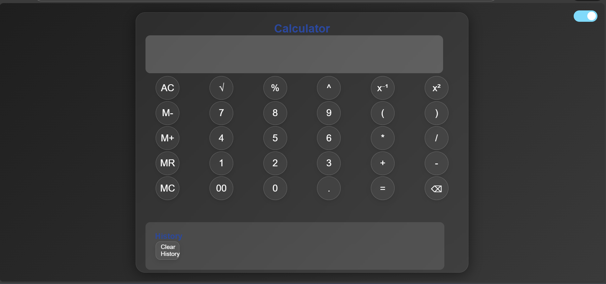

# 🧮 Advanced Calculator Web App

A feature-rich and visually modern **Calculator Web Application** built using **HTML, CSS, and JavaScript**.  
This project goes beyond basic calculations by offering **memory functions, calculation history, dark mode, and keyboard support**, all wrapped in a sleek glassmorphism UI.

---

## ✨ Features

- ➕➖✖️➗ Basic arithmetic operations  
- 📐 Advanced operations (square, square root, reciprocal, power)  
- 🧠 Memory functions (M+, M−, MR, MC)  
- 🕘 Calculation history with clear option  
- ⌨️ Full keyboard support  
- 🌗 Light / Dark mode toggle  
- 🎨 Glassmorphism UI with gradients  
- 📱 Fully responsive for all devices  

---

## 🚀 Live Demo

🔗 https://anshu-dha.github.io/basic-calculator-project/

---

## 📸 Preview

  

---

## 🛠️ Built With

- **HTML5** – Semantic structure  
- **CSS3** – Glassmorphism, gradients, responsive design  
- **JavaScript (ES6)** – Calculator logic, DOM manipulation, keyboard events  

---

## 🎯 Learning Highlights

- Implementing **complex calculator logic** in JavaScript  
- Handling **keyboard events** for better UX  
- Working with **JavaScript memory operations**  
- Managing UI state for **dark/light themes**  
- Creating a **responsive grid-based layout**  
- Using **glassmorphism and modern UI effects**

---

## 🔮 Possible Enhancements

- 📊 Scientific calculator mode  
- 🧾 Export calculation history  
- 🔊 Button click sound effects  
- 🧠 Expression validation without `eval()`  
- 🌍 Multi-theme color presets  

---

## 👩‍💻 Author

**Anshu**  
Frontend Developer | Web Enthusiast  

---

⭐ If you like this project, don’t forget to star the repository!

